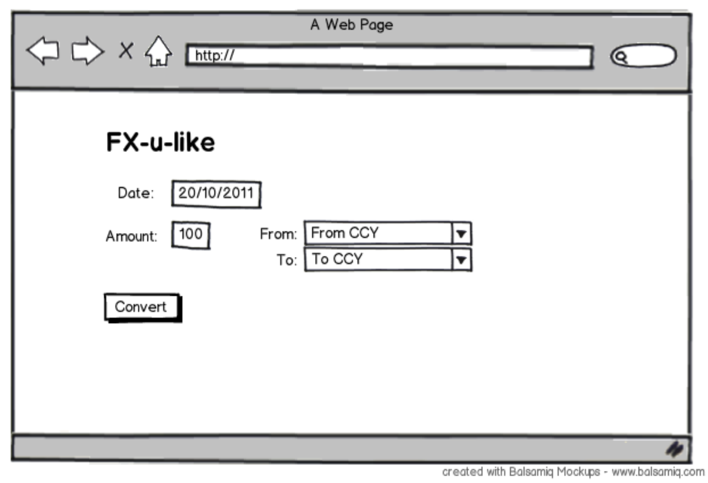

# Foreign Exchange Challenge

Your challenge for today is to delve deep into the work of foreign exchange (FX) to provide a library for obtaining FX rates. And a handy web interface to demo the functionality of the library.


## Interface

Here’s how a client would expect to use the library where GBP is the base currency and USD is the counter currency:

```ExchangeRate.at(date.today(), 'GBP', 'USD')```

## Data Source

During development, the data source of FX rates will be the 90-day European Central Bank (ECB) feed:

http://www.ecb.europa.eu/stats/eurofxref/eurofxref-hist-90d.xml

It’s likely we’ll use an alternative provider in production.

## Data Storage

We don’t want to be beholden to the ECB website in order for our library to work, so the data should be pre-fetched and stored locally. You can assume we'll be doing this once a day using [cron](https://en.wikipedia.org/wiki/Cron) for now.

When requesting a rate, the library should load it from the store, not from the feed.

## Web App

To demonstrate the library, we’re going to hook it up to a web app that demonstrates converting between the available currencies for a given date, defaulting to today.

Here’s how it might look:


